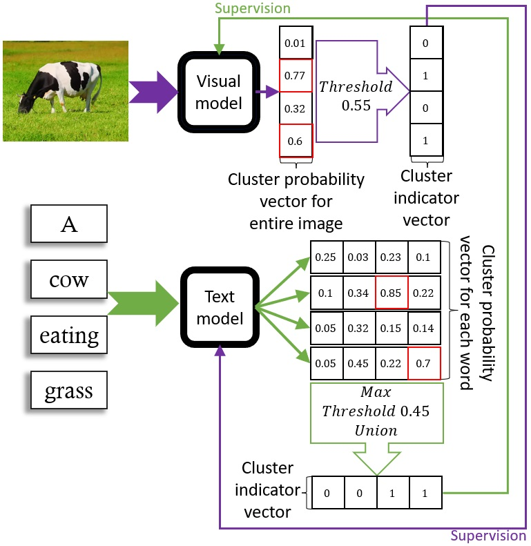

# Multimodal Self-Supervised Clustering

Our model consists of two encoders (a visual encoder and a text encoder), both of which encode relevant inputs into a binary discrete space interpreted as multi-label clustering of the inputs. The model is initialized randomly, without pre-training, and is trained in a self-supervised manner using (image, caption) pairs.

## Visualization of the Model

## Installation

1. Install all packages in the requirements.txt

2. Create a datasets dir, and download the following datasets:

    a. MSCOCO (Lin et al., 2014): if you want to train a model or evaluate the model on visual metrics. Locate in a directory named 'COCO' (under the datasets directory).
    
    b. Fountain & Lapata's (2010) categorization dataset: if you want to evaluate the model on the taxononmic categorization metric. Locate the yaml file (mcrae_typicality.yaml) under the datasets directory.
    
    c. Brysbaert et al.'s (2014) concereteness dataset: if you want to evaluate the model on the concreteness prediction metric. Locate the text file (Concreteness_ratings_Brysbaert_et_al_BRM.txt) under the datasets directory.
    
    d. Small World of Words (De Deyne et al., 2019): if you want to evaluate the model on the syntagmatic categorization metric. Locate the csv file (swow.en.csv) under the datasets directory.

3. Run the setup.csh script and provide the python executable and path to the datasets dir:

        source setup.csh <path to python executable> <path to datasets dir>
        
Note: the setup may take several minutes.

## Download Pre-trained models

To use our pre-trained models, please:

- download the files from the following link:
    https://drive.google.com/drive/folders/1S4f9kKGD7uXizhNPzsdJcb1PmZhZqh9Q?usp=sharing
- Create a 'models' directory under the project root
- Create a 'models/text' directory, and unzip the text_models.zip file into it
- Create a 'models/visual' directory, and unzip the visual_models.zip file into it

## Usage

To train the model, run the following command:

        <path to python executable> main.py --utility train_joint_model --datasets_dir <path to datasets dir>
        
To evaluate the provided trained model on all text metrics, run the following command:

        <path to python executable> main.py --utility text_evaluation --model_name model1 --datasets_dir <path to datasets dir>
        
To evaluate the provided trained model on visual metrics, run the following command:

        <path to python executable> main.py --utility visual_evaluation --model_name model1 --datasets_dir <path to datasets dir>
        
For the list of all utilities, and command line options, run the following command:

        <path to python executable> main.py --help
        
        
        
## References

Brysbaert, Marc, Amy Beth Warriner, and Victor Kuperman. "Concreteness ratings for 40 thousand generally known English word lemmas." *Behavior research methods* 46.3 (2014): 904-911.

De Deyne, Simon, et al. "The “Small World of Words” English word association norms for over 12,000 cue words." *Behavior research methods* 51.3 (2019): 987-1006.

Fountain, Trevor, and Mirella Lapata. "Meaning representation in natural language categorization." *Proceedings of the Annual Meeting of the Cognitive Science Society*. Vol. 32. No. 32. 2010.

Lin, Tsung-Yi, et al. "Microsoft coco: Common objects in context." *European conference on computer vision*. Springer, Cham, 2014.
